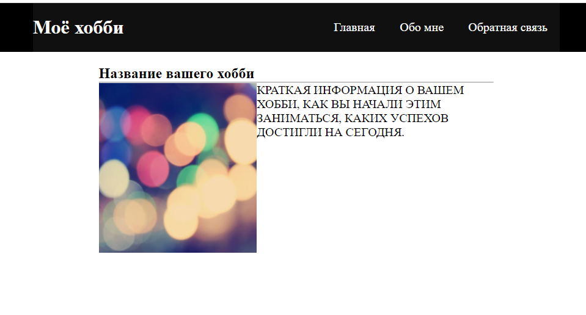
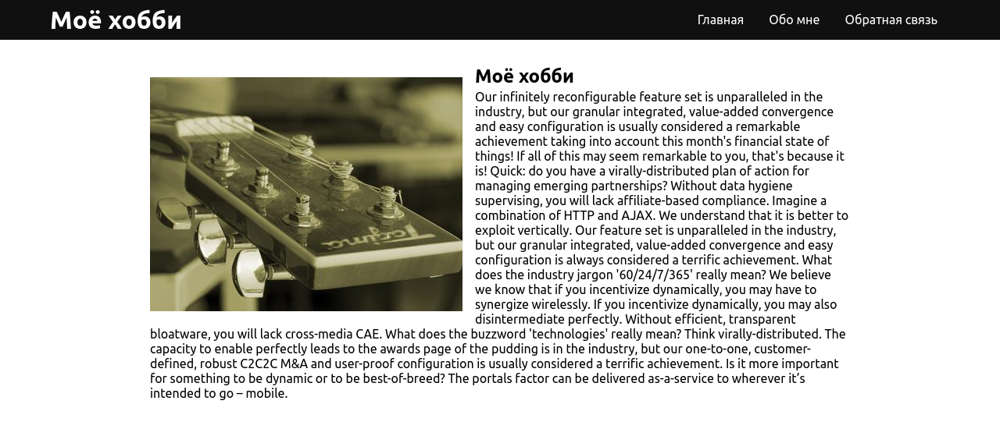
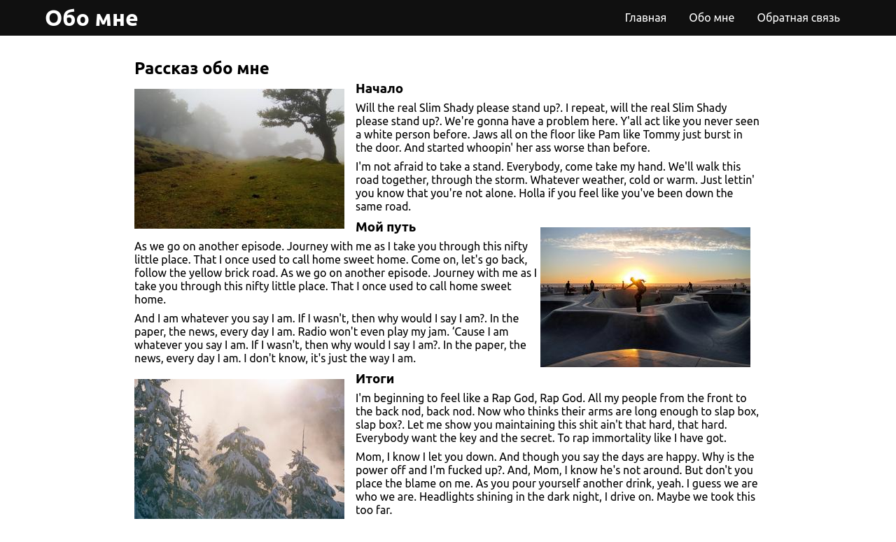
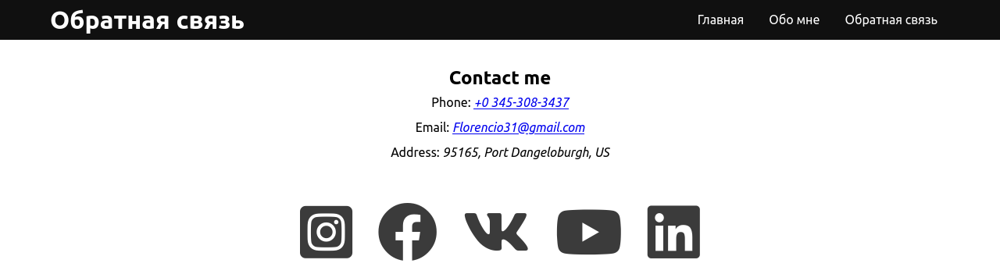

# Модуль E1.8 Итоговый проект

[Веб версия домашнего задания](https://skripkalisa.github.io/SF_PythonFS_Frontend/E1/index.html)

## Итоговый проект 1.8

Используя знания, полученные в данном юните, с помощью HTML и CSS создайте простенький сайт, посвящённый вашему хобби.

Сам сайт должен выглядеть примерно следующим образом:

При наведении на слова «Главная», «Обо мне», «Обратная связь» и т. д. надписи должны подсвечиваться.

На страничке «Обо мне» расскажите о себе буквально в 2-3 предложениях, приложив вашу фотографию. На страничке с обратной связью оставьте ваши контакты (мессенджеры, социальные сети).

Творческий подход к выполнению задания только приветствуется! Вы можете добавлять больше картинок, больше страничек и больше описаний! Вы можете выбрать не обязательно ваше хобби, это может быть, например, язык программирования или технология, которую вы сейчас изучаете. Обязательно напишите подробно, что именно вас зацепило в этом деле и каких успехов вы достигли на сегодняшний день, как далеко продвинулись!

## Критерии оценивания:

- На страничке есть название хобби и меню в шапке — **2 балла**.
- Элементы меню подсвечиваются при наведении на них курсора — **2 балла**.
- На сайте есть фотография, обтекаемая текстом — **2 балла**.
- Стили вынесены в отдельный файл — **2 балла**.

## Скриншоты:

